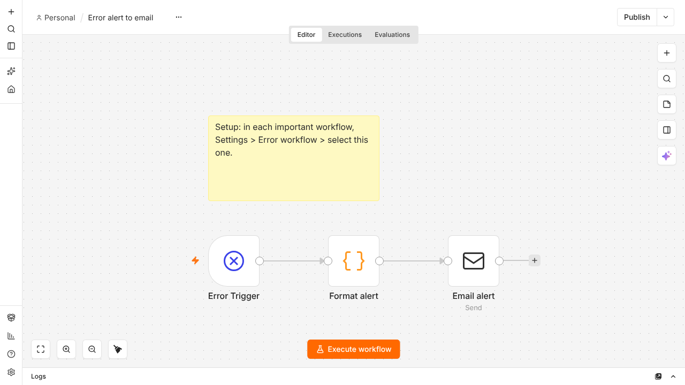

# n8n Error Alert (free)

A small n8n workflow that emails you when any other workflow fails: which workflow, which node, the error message and a link to the execution.

## What it does
When any workflow you attach it to fails, you get an email with the workflow name, the failing node, the error message and a link to the execution.

## Use
1. In n8n: Workflows > Import from file > `error-alert.json`.
2. Select your SMTP credential on the "Email alert" node and set the from/to addresses (placeholders: `you@example.com`).
3. **Publish/activate** this workflow.
4. In each workflow you care about: Settings > Error workflow > select this one.

The workflow ships inactive. Tested in a real local n8n 2.35 (a deliberately failing workflow produced the alert email via a test mail server).

## Alert didn't fire?
See [TROUBLESHOOTING.md](TROUBLESHOOTING.md): a checklist built from seven tested cases.

## Test it yourself
`testing/` has a tiny local SMTP sink (`smtp_sink.py`) and a short guide (`TESTING.md`) for checking email workflows without sending real mail, including how to assert how many emails a run produced.

## See also
[n8n Heartbeat Watchdog](https://github.com/NotOptional1/n8n-heartbeat-watchdog): catches the opposite failure, a scheduled job that silently didn't run, which an error workflow can't see.

## Want more?
This is one of 5 workflows in the **n8n Small-Business Ops Pack** (invoice reminders, lead intake, weekly digest, consent-based review requests): https://gilishe.gumroad.com/l/n8n-ops-pack

## Notices
MIT licensed (see LICENSE). n8n is a trademark of n8n GmbH; this workflow is not affiliated with or endorsed by n8n. It runs on n8n under n8n's own licence, which you accept when you use n8n. Created with AI assistance (Claude) and tested as described here.
